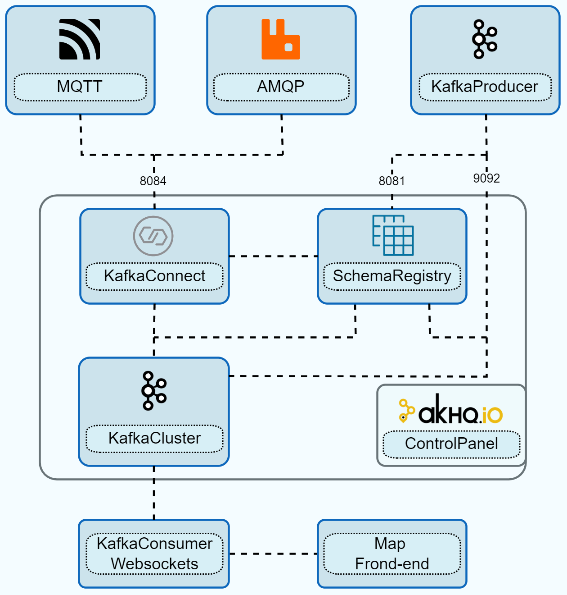
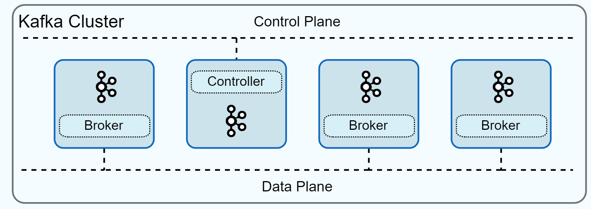
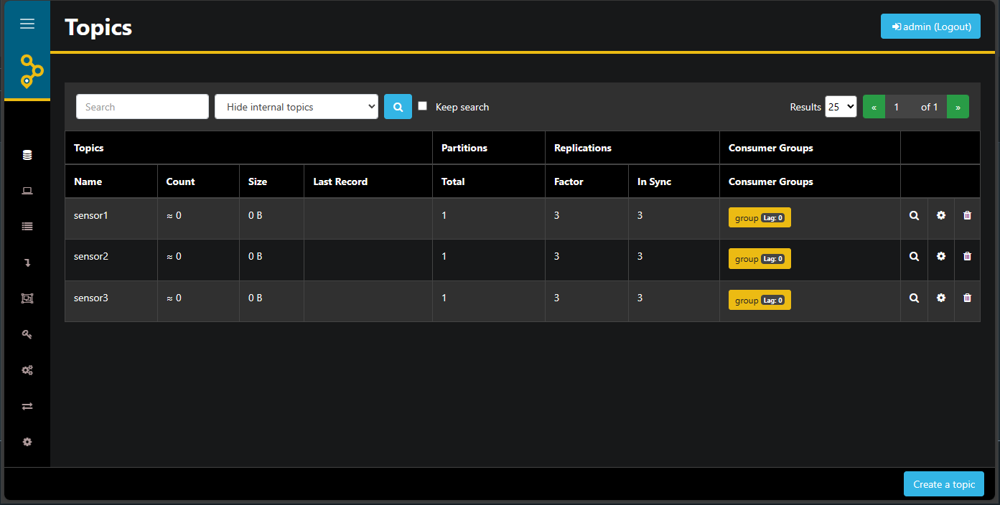
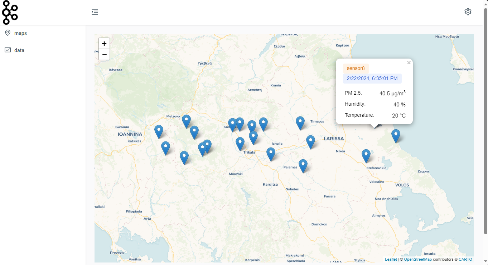
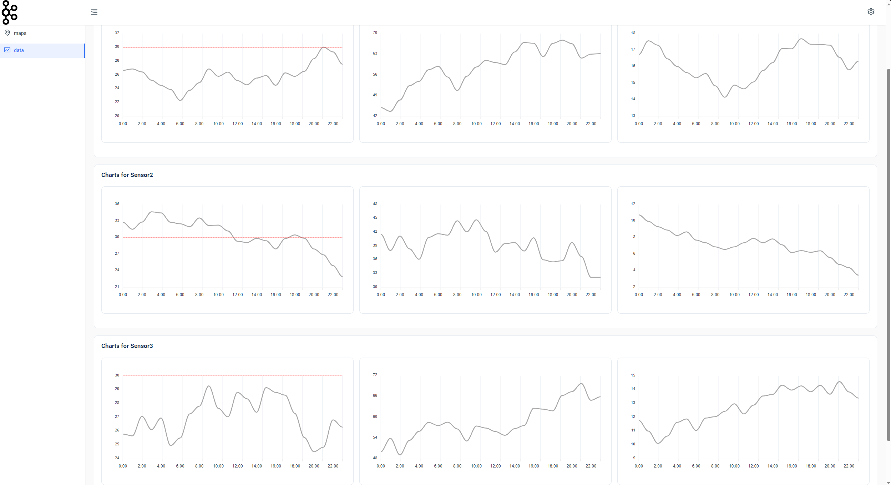

**<a href="https://nkolovos.github.io/Event-Driven-Streaming-Platform/KafkaThesisBuild/Nikoloas_Kolovos_presentation.pdf" target="_blank">Next Page</a>**
 
**[Prev Page](https://nkolovos.github.io/Event-Driven-Streaming-Platform/)**

**[Repository Web view](https://nkolovos.github.io/Event-Driven-Streaming-Platform/)**
 
**<a href="https://github.com/nkolovos/Event-Driven-Streaming-Platform" target="_blank">Repository Git view</a>**
testing
# Architecture and Implementation  
In this chapter, we are going to analyze and present the technical details of our project. We explore the critical aspects of our project, focusing on the implementation and execution of our designed solution. In addition, we provide details on the system's architecture, the chosen configurations and a further explanation of the key fundamentals that were prioritized for our implementation. Furthermore, we outline the main challenges encountered during the implementation phase and how we addressed them.  
  
## System Overview  
Our system is divided into three primary layers: the data ingestion processes, the events streaming and storage and data consumption and distribution in our front-end map. The system's architecture is presented extensively in Figure 1.  
  
Starting from the top, three protocols for producers are supported: native Kafka, AMQP and MQTT. A RabbitMQ broker within the SYNAISTHISI platform manages messages generated by MQTT and AMQP clients. Subsequently, Kafka Connect interlinks our events from the RabbitMQ broker with our Kafka Cluster. We primarily utilize source connectors for our air quality application, meeting our data flow requirements. The Schema Registry is mainly used for our native Kafka producers, in order to validate our data and minimize the message size sent to our Kafka cluster. Avro is utilized as the serialization format in our Schema Registry service.  
  
Events are subsequently streamed into our Kafka cluster. Our cluster operates in KRaft mode and consists of four nodes. A single controller node maintains the health of our Kafka cluster and performs tasks related to load-balancing and data recovery, in the cases that runtime failures occur. The remaining three nodes are data brokers configured in prioritizing data reliability, availability and ordering. In order to monitor and manage our Kafka Cluster and its associated services, such as Kafka Connect and Schema Registry, we have integrated an advanced control panel. AKHQ provides us with a user friendly graphical interface, allowing us to maximize our operational capabilities in a modern and accessible manner.  
  

  
   
  

    <strong>Figure 1: System Architecture</strong>
  

<!--    -->

 

Additionally, a web application has been developed to display measurements on a live map. An automated process parses through the Kafka topics and assigns consumers to them. Both simple and Avro consumers are orchestrated to work in sync to fetch live events from our cluster. Web-Sockets, over a TCP connection, is continuously active application, ready to transfer data from our server side to our web browser. For our front-end we utilize React and OpenStreetMap to present the measurements on a contemporary, visually appealing map-based web page. Each point on the map represents sensors that continuously update and refresh their values. This configuration guarantees real-time and precise data representation, while ensuring low latency, high throughput and optimal availability.  
  
## Data Ingestion  
Continuing with the principles of the SYNAISTHISI platform, we provide support for the primary messaging protocols that are found in the majority of IoT infrastructures. This support allows us to establish connections with a wide variety of sensors, gateways and devices. By doing so, we enable the interoperability, scalability and interconnectivity principles that our application requires. Aside from our focus on air pollution measurements, our platform is capable of utilizing any type of data that is supported by these protocols. This flexibility helps us to adapt and configure our application for different kinds of implementations. Furthermore, we are not only confined to the typical messaging protocols that are commonly used in IoT applications, but utilizing more advanced protocols like Avro. Avro allows us to handle more complex data structures and provides us with additional capabilities, enhancing the overall functionality, versatility and upgradability of our platform.  
  
### Producers  
We have created a set of producers for each protocol, aiming to simulate the respective clients that would publish our measurements to our brokers. These producers are written in Python in our implementation, but the operators of our application can choose any language pack depending on the compatibility of their devices and gateways. Our primary messages are based on the JSON file format, that provide us a broad system support and the ability to configure the rest of our infrastructure based on an internet standard message type. The majority of messaging and event-driven applications primarily use JSON due to its simplicity and widespread support across virtually all cloud infrastructures.  
  
Additionally, messages are structured in JSON files containing the following fields: DeviceID, Latitude, Longitude, PM₂.₅ concentration in micro grams per cubic meter of air (µg/m³), Humidity in percentage (%), Temperature in Celsius (°C) and Timestamp, as can be seen in Figure 2. DeviceID is the name or label of a given device that fetches measurements. Latitude and longitude represent the coordinates where each device is located and enable us to locate our device on our live map. If our devices support GPS, the coordinates should be imported to these fields, otherwise operators should input the approximate location. PM₂.₅, temperature and humidity are the primary data needed for our air quality application. The Timestamp field provides us with the time and date when our event took place.  
  
### Interoperability Kafka Connect   
The data produced by MQTT or AMQP clients, are directed to our SYNAISTHISI RabbitMQ server. In this manner, we have implemented Kafka Connect to fetch our data from our RabbitMQ broker to our Kafka cluster. We have integrated both source and sink connectors for MQTT and AMQP, therefore supporting bidirectional communication between RabbitMQ and Kafka. In our application, we utilize the source connector (which inserts data from an external system into our Kafka Cluster) for both MQTT and AMQP, as it aligns with our application's data flow requirements. This setup enables our Kafka infrastructure to interact with external systems in a straightforward and accessible manner.  
  
Connectors are configured in distributed mode, which allows us to replicate the deployed workers, activating the fault-tolerant capabilities of Kafka Connect workers. It is worth noting that we deploy a single worker on each connector, not multiple ones, but users of our platform have the option to replicate the workers in case they want to protect the Connect workers from runtime failures. Our workers can be both schema enable or not, enabling the data validation routine for non Kafka producers as well. As discussed in Kafka Connect section (cf. Sec. 3.4), Kafka Connect allows us to interconnect our Kafka cluster with a wide variety of external systems and services. This eliminates the need to write additional code each time we integrate a new external service, thus significantly reducing our development time.  
  
### Data Validation Schema Registry  
We also utilize the Schema Registry in our application, both for native Kafka producers and for Connect workers. Schema Registry allows us to implement a more compact communication protocol. The initial JSON messages are serialized into an efficient binary format, ready to be broadcast to the Kafka Cluster. This process enables us to reduce the size of the JSON events that are sent to our Kafka Cluster, decreasing the message size by 40% or more, depending on the size of the JSON files and the number of fields. The more fields a JSON file has, the greater the reduction in message size, thanks to the efficient compression in Avro. It requires the initial message to be in JSON format before being converted, ensuring a consistent event data structure whether we utilize the Schema Registry or not. One advantage of Avro over similar protocols is its wide support across various communication and messaging infrastructures. This makes our platform highly efficient, sophisticated and highly configurable, depending on our implementation  
  
In our implementation, our Kafka producers utilize Avro. This gives us comprehensive control over our data structure and the fields necessitated in our JSON files. We generate an AVSC file, which is a JSON format file that defines the schema or structure of the data to be serialized using Avro, as shown in Figure 2. For instance, if we desired to make the 'Humidity' field optional and the 'PM₂.₅' required, the message streaming would persist even if the former missing, but would stop if the latter was missing. In our implementation all fields are required, so we designate them all as mandatory. This provides a centralized way to supervise and monitor our data structure and compatibility in an organized and secure manner. Last but not least, data sent from our MQTT and AMQP connectors in our air quality application do not utilize the Schema Registry, as we want to simulate situations where we interconnect our platform to pre-existing sensors and aim to avoid developing new code when connecting them.  
  

  
  

  
  <pre>  
{  
  "deviceId": "sensor2",  
  "latitude": 39.36103,  
  "longitude": 22.94248,  
  "pm25": 12.5,  
  "temperature": 22.5,  
  "humidity": 60.0,  
  "timestamp": 164099520  
}  
  </pre>  

  
  

  
  <pre>  
{  
  "type": "record",  
  "name": "SensorData",  
  "fields": [  
    {"name": "deviceId", "type": "string"},  
    {"name": "latitude", "type": "double"},  
    {"name": "longitude", "type": "double"},  
    {"name": "pm25", "type": "float"},  
    {"name": "temperature", "type": "float"},  
    {"name": "humidity", "type": "float"},  
    {"name": "timestamp", "type": "long"}  
  ]  
}  
  </pre>

  
  

  
  
**Figure 2: Presentation of our JSON file (on the left) and our Avro Schema (AVSC, on the right).**

## Data Structure  
In the Events and Producers sections (see Sec. 3.2.2, 4.2.1), we discuss how our JSON messages are structured in both a general event message example and in our specific implementation. However, the format presented is the human-readable one, which is how the data will appear on our front-end page. The actual JSON files, when ingested into our Kafka cluster, will appear as shown in Figure 2. Most of the fields remain understandable and human-readable, even in this form. The exception is the timestamp, as we utilize Unix epoch time, which represents a specific time as a single number. The Unix timestamp is widely adopted in most computing environments due to its compact size and simplicity for data storage and transmission. Therefore, we only need to convert it into a human-readable form when we intend to display it in our application, while our data structure remains highly scalable and flexible.  
  
## Kafka Cluster Configuration and Management  
During the development of our Kafka Cluster, we faced a series of challenges. Our primary objective was to create a platform that would be highly available and easily upgradable for integration with other applications too. The configuration we chose for our Cluster reflects that of a production environment, minimizing the need for operators to make further extensive configurations when hosting their own applications on this part of our platform. We designed an implementation that aligns closely with enterprise-level features and requirements, while maintaining IoT principles of simplicity and ease of use.  
  
Our implementation is developed to seamlessly interconnect with our existing SYNAISTHISI platform, ensuring a unified and interconnected system. We leveraged the latest technologies to optimize our Cluster's performance, achieving high-speed data streaming and processing without compromising its robust fault tolerance capabilities. This balance between speed and reliability is a critical aspect of our project, as it ensures our platform can handle large volumes of data while maintaining durability during runtime failures. By addressing these challenges, we have created a Kafka Cluster that is not only powerful, scalable, and reliable but also adaptable and user-friendly, making it a valuable tool for anyone who wishes to take advantage of it.  
  
### Cluster Configuration  
Our cluster is structured in a four-node Kafka implementation, as depicted in Figure 3. Our nodes function either as controllers or data brokers, with a single node and three nodes serving as the controller and data brokers respectively. This is the recommended production implementation by the Apache project, as combined controller/broker nodes are primarily used for presentations, early development, and testing purposes. This setup allows us to leverage the high throughput and fault tolerance features that Kafka is capable of. Furthermore, depending on the demand of our application, we have the flexibility to scale our cluster from three brokers to five, seven, and beyond. This scalability ensures that we can meet the increasing demands, if needed, without compromising the performance or reliability of our system.  
  
Instead of opting for the deprecated Zookeeper control plane, we employ the relatively new KRaft protocol. Adopting KRaft significantly increases the speed of data recovery and re-balance time when a broker node fails during operation and it provides better metadata management compared to Zookeeper. The internal configuration we have established allows us to expose only a single port (9092) of our cluster. The rest of the data flow is contained within our cluster, eliminating the need to expose our system further. This approach enhances the security of our implementation while maintaining its efficiency and effectiveness, as shown in Figure 1.  
  
### Control Plane  
Furthermore, we utilize a single controller node in our control plane without replicating it, as seen in Figure 3. This approach helps us avoid unnecessary complexity and overhead, without direct exposure to the risk of data loss. We need to note that this decision was made after careful consideration of our requirements and priorities. While replicating the controller node could theoretically increase fault tolerance, it would also introduce complexities and potential synchronization issues. Instead, our focus on fault tolerance is achieved through replicating only the data brokers. This way, even if our controller node goes down during runtime, our data within the brokers remains safe. By leveraging a single node control plane configuration we achieve a firm balance between simplicity and robustness in our Kafka implementation.  
  
<!--    -->

  
   
  

    <strong>Figure 3: Cluster Configuration</strong>
  

### Data Plane  
Our three broker data plane endows our system with enhanced reliability, fault tolerance, and scalability. Firstly, this configuration offers superior fault tolerance compared to single and two-broker clusters. In the event that one of our brokers fails, Kafka will redistribute the load across the remaining two brokers. Since we are utilizing KRaft, the time needed for our Kafka Cluster to re-balance the replicated data is significantly minimized. The residual two nodes are able to maintain the data flow, ensuring minimal downtime during our cluster and application operation. This approach guarantees high availability for our platform, preventing disruption to our data streaming process in case of a broker failure.  
  
Moreover, in terms of scalability, a three broker configuration is beneficial as the workload is distributed across multiple nodes. This arrangement distributes our data across each broker, ensuring a balanced workload. If the data volume and processing requirements escalate, we can increase the partition count on any given topic. Given the design of our data plane, we have the flexibility to easily expand our infrastructure with additional brokers if necessary. This ability to scale horizontally allows us to adjust to changing workload demands and ensures our platform is prepared for future expansion and enhancements. In this way, we have achieved an optimal balance between fault tolerance and scalability, making our implementation adaptable to a broad range of use cases.  
  
### Control Panel  
Last but not least, we have implemented a control panel using AKHQ, which provides a contemporary and accessible graphical interface for managing our Kafka Cluster and its associated services. In addition to the SYNAISTHISI platform interface, operators can utilize this control panel to create topics, seen in Figure 4. It also facilitates schema creation, modification, and evolution within our Schema Registry service. All Kafka Connect workers can be deployed and controlled from this panel, simplifying monitoring and management during application runtime. This eliminates the need for users to rely on CLI (Command-line interface) tools, offering a more modern management method. As both self-managed and fully-managed cloud service providers rely on graphical interface control panels for their operations, our approach aligns with this standard. AKHQ is based on an open-source project with numerous contributors, guaranteeing its ongoing support and maintenance.  
  
<!--  -->
  
**Figure 4: Control Panel Overview**
  
## Web Application  
In this section, we analyze the creation of a server-less side, back-end service and front-end page. These components fetch data from our cluster and display them on a live map. This implementation is specifically designed for our air quality application and is not a general-purpose platform like the Data Ingestion and server-side parts. On this regard, we have implemented a service that consumes live data from our Kafka Cluster and automatically detects the addition of new devices in our cluster. The consumed events are then sent over Web-Sockets to our front-end map, which is hosted as part of our modern-looking React live page.  
  
### Kafka Consumer  
Whenever a topic is added to our server-side, the back-end service automatically detects the newly added topic. Each sensor, device, etc. on our map is uniquely identified by the key that has been assigned to it. Kafka consumers then read the incoming live events and list them in a batch of messages. In our application, the consumption rate is every five minutes, but this can be modified to any preferred frequency. Consumers can either be simple Kafka consumers or schema-enabled ones, as our universal JSON event message structure allows us to utilize both without any incompatibilities. This highlights the importance of having a firm and well-thought-out structure for our event streaming data, as it allows us to consume and process our events efficiently, eliminating the time required for post-consumption data modifications from the cluster.  
  
### Web-sockets Integration  
To facilitate the interconnection between our back-end service and front-end map, we utilize Web-Sockets. Web-Sockets is a protocol that unlike traditional HTTP connections, establishes a continuous communication channel over a single TCP connection between the front-end and back-end. Web-Sockets does not have any limit on the batch size that can be transmitted, making it an excellent choice for our needs of continuous data flow for the events consumed by our Kafka Consumer service. This ensures flawless real-time data transmission and enhances the responsiveness of our application. Furthermore, we minimize the need for frequent HTTP polling, which enhances our application's network efficiency. Therefore, by leveraging Web-Sockets, we can effectively align with the high-volume and real-time data streaming capabilities that our Kafka infrastructure offers.  
  
### Front-end Map  
Our live front-end map is developed utilizing React, a modern and efficient development environment. This framework allows us to create a visually appealing and highly functional web page, ideal for displaying real-time data. The map we utilize is based on Leaflet OpenStreetMap, a widespread open-source map solution that perfectly suits our application needs. In addition to its efficiency, the component-based architecture of React enables us to easily manage and update our application's interface, ensuring a smooth user experience.  
  
Our web page is divided into two primary sections, the map section and the data section. In the map section, Figure 5, each point represents a sensor at a specific location. When a point is selected, it displays the measurements from the corresponding sensor. As detailed in the Data Structure section (cf. Sec. 4.2.4), our measurements include the device name, the time of the measurement, PM₂.₅ concentration (µg/m³), Humidity (%), Temperature (°C). The data is presented in a bracket when each point on the map is selected. Whenever a new device is incorporated into our platform, a new point is automatically created on the map according to the device's coordinates. Consequently, this way our map page maintains a dynamic, user-friendly and modern design.  
  
The other section of our page features a set of dashboards, Figure 6, each designed to display the three key measurements from our sensors: particle matter concentration, humidity percentage and temperature. Each set of tables within the dashboards corresponds to a specific point on the map. As these points are dynamically updated on the map to reflect the real-time locations of our sensors, the relevant tables in the dashboards adjust accordingly. This ensures that the set of data displayed is always updated. Moreover, the system allows us to display measurements from various time frames. Users can view measurements from a single day, three days, or a week old, providing them a comprehensive view of understanding of fluctuations over these periods.  
  
<!--  -->
  
**Figure 5: Live Map Overview**
  
<!--  -->
  
**Figure 6: Historical Data Dashboard Overview**

**<a href="https://nkolovos.github.io/Event-Driven-Streaming-Platform/KafkaThesisBuild/Nikoloas_Kolovos_presentation.pdf" target="_blank">Next Page</a>**
 
**[Prev Page](https://nkolovos.github.io/Event-Driven-Streaming-Platform/)**
