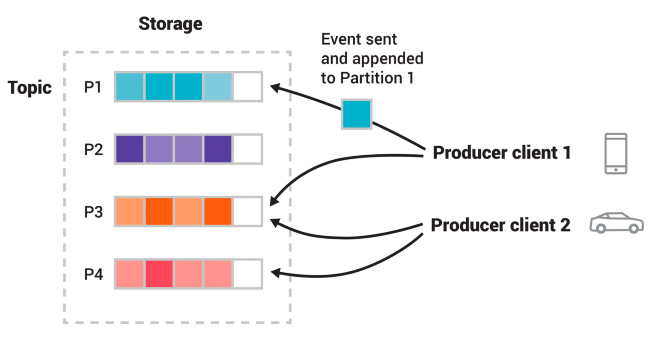

# Kafka Synaisthis API Configuration

To run the Kafka implementation:

1. Set `KAFKA_ENABLE` to true located in `/synaisthisi-container/docker_compose/docker-compose` under the flask service. This enables the key API functionalities related to Kafka and Kafka Connect through the Synaisthisi control panel.

2. Set the following parameters located in `/synaisthisi-container/docker_compose/.env`:

   - `KAFKA_BOOTSTRAP_SERVER`: Defines the Kafka broker's address.
   - `KAFKA_CONNECT_SERVER`: Specifies the Kafka Connect server's address.
   - `KAFKA_TOPIC_PARTITIONS`: Determines the number of topic partitions.
   - `KAFKA_TOPIC_REPLICATION_FACTOR`: Sets the replication factor.

 
 

# **Apache Kafka Documentation**

## Use cases of [Apache Kafka](https://docs.confluent.io/kafka/introduction.html#use-cases)

- As a messaging system. For example Kafka can be used to process payments and financial transactions in real-time, such as in stock exchanges, banks, and insurance companies.

- Activity tracking. For example Kafka can be used to track and monitor cars, trucks, fleets, and shipments in real-time, such as for taxi services, in logistics and the automotive industry.

- To gather metrics data. For example Kafka can be used to continuously capture and analyze sensor data from IoT devices or other equipment, such as in factories and wind parks.

- For stream processing. For example use Kafka to collect and react to customer interactions and orders, such as in retail, the hotel and travel industry, and mobile applications.

## Why Kafka?
- **High Throughput**
Capable of handling high-velocity and high-volume data, Kafka can handle millions of messages per second.

- **High Scalability**
Scale Kafka clusters up to a thousand brokers, trillions of messages per day, petabytes of data, hundreds of thousands of partitions. Elastically expand and contract storage and processing.

- **Low Latency**
Can deliver these high volume of messages using a cluster of machines with latencies as low as 2ms

- **Permanent Storage**
Safely, securely store streams of data in a distributed, durable, reliable, fault-tolerant cluster

- **High Availability**
Extend clusters efficiently over availability zones or connect clusters across geographic regions, making Kafka highly available and fault tolerant with no risk of data loss.

## **Key Components** of [Apache Kafka](https://docs.confluent.io/kafka/introduction.html#terminology)

### Brokers
A broker refers to a server in the Kafka storage layer that stores event streams from one or more sources. A Kafka cluster is typically comprised of several brokers. Every broker in a cluster is also a bootstrap server, meaning if you can connect to one broker in a cluster, you can connect to every broker.

### Topics
The Kafka cluster organizes and durably stores streams of events in categories called topics, which are Kafka’s most fundamental unit of organization. A topic is a log of events, similar to a folder in a filesystem, where events are the files in that folder.

### Partitions
Topics are broken up into partitions, meaning a single topic log is broken into multiple logs located on different Kafka brokers. This way, the work of storing messages, writing new messages, and processing existing messages can be split among many nodes in the cluster. This distributed placement of your data is very important for scalability because it allows client applications to both read and write the data from/to many brokers at the same time.

When a new event is published to a topic, it is actually appended to one of the topic’s partitions. Events with the same event key such as the same customer identifier or vehicle ID are written to the same partition, and Kafka guarantees that any consumer of a given topic partition will always read that partition’s events in exactly the same order as they were written.

### Producers
Producers are clients that write events to Kafka. The producer specifies the topics they will write to and the producer controls how events are assigned to partitions within a topic. This can be done in a round-robin fashion for load balancing or it can be done according to some semantic partition function such as by the event key.

### Consumers, Consumer Groups
Consumers are clients that read events from Kafka.The only metadata retained on a per-consumer basis is the offset or position of that consumer in a topic. This offset is controlled by the consumer. Normally a consumer will advance its offset linearly as it reads records, however, because the position is controlled by the consumer it can consume records in any order. For example, a consumer can reset to an older offset to reprocess data from the past or skip ahead to the most recent record and start consuming from “now”.

### Replication
Replication is an important part of keeping your data highly-available and fault tolerant. Every topic can be replicated, even across geo-regions or datacenters. This means that there are always multiple brokers that have a copy of the data just in case things go wrong, you want to do maintenance on the brokers, and more. A common production setting is a replication factor of 3, meaning there will always be three copies of your data. This replication is performed at topic partition level.

 

 

(used for bitbucket compatibility issues)

 
 

# **Schema Registry** [Overview](https://docs.confluent.io/platform/current/schema-registry/index.html#sr-overview)

### What is Schema Registry?
Schema Registry provides a centralized repository for managing and validating schemas for topic message data, and for serialization
A tool that converts objects and parallel data into a serial byte stream. Serializers work with deserializers (known together as Serdes) to support efficient storage and high-speed data transmission over the wire. Confluent provides serializers for schemas in Avro, Protobuf, and JSON Schema formats.
 and deserialization of the data over the network. Producers and consumers to Kafka topics can use schemas to ensure data consistency and compatibility as schemas evolve. Schema Registry is a key component for data governance, helping to ensure data quality, adherence to standards, visibility into data lineage, audit capabilities, collaboration across teams, efficient application development protocols, and system performance.

### Why use Avro Schema Registry?

The Confluent Schema Registry based Avro serializer, by design, does not include the message schema; but rather, includes the schema ID (in addition to a magic byte) followed by the normal binary encoding of the data itself. You can choose whether or not to embed a schema inline; allowing for cases where you may want to communicate the schema offline, with headers, or some other way.

 

 

(used for bitbucket compatibility issues)