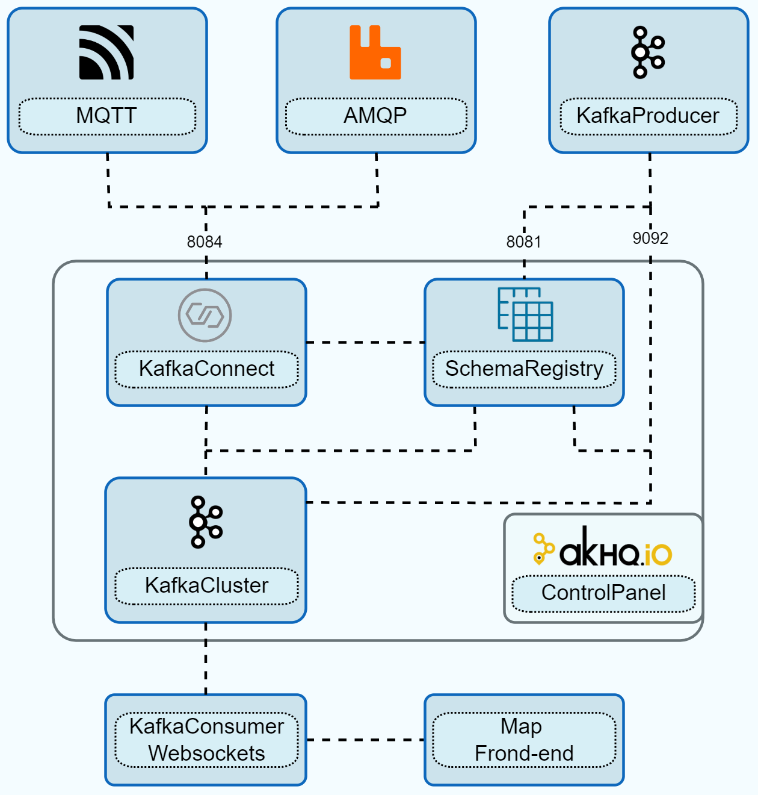

**[Next Page: Architecture](https://nkolovos.github.io/Event-Driven-Streaming-Platform/KafkaThesisBuild/)**

**[Repository Web view](https://nkolovos.github.io/Event-Driven-Streaming-Platform/)**
 
**<a href="https://github.com/nkolovos/Event-Driven-Streaming-Platform" target="_blank">Repository Git view</a>**

## **What does this repository contain?**

<!--  -->

### This repository contains the following folders:
- **<a href="https://github.com/nkolovos/Event-Driven-Streaming-Platform/tree/main/KafkaClients" target="_blank">KafkaClients</a>** : This folder contains the code for Kafka clients, both custom and confluent SDK clients. They are useful for making various operations on our Kafka cluster from the client side.

- **<a href="https://github.com/nkolovos/Event-Driven-Streaming-Platform/tree/main/KafkaDocker" target="_blank">KafkaClients</a>** : This folder contains the docker-compose file for setting up our application in various configurations and approches.

- **<a href="https://github.com/nkolovos/Event-Driven-Streaming-Platform/tree/main/KafkaThesisBuild" target="_blank">KafkaClients</a>** : This folder contains the final build of our Thesis streaming application, excluding the React frontend Live-map, which is located in the [LiveMapReact](https://github.com/nkolovos/LiveMapReact)  repo. Here you will find detailed inforamtion on the **[architecture](https://nkolovos.github.io/Event-Driven-Streaming-Platform/KafkaThesisBuild/)** and the implementation of the application, in addtion with useful information on event-driven applications.

  

**[Next Page: Architecture](https://nkolovos.github.io/Event-Driven-Streaming-Platform/KafkaThesisBuild/)**

## **Future Goals**

The whole project was developed with scalability in mind, and it is designed to be easily extended and modified. One of the future goals is the implementation of **Apache Flink** for real-time processing of the data streams, instead of the current custom monolithic approach.

In addition, the development of enterprise-level security by utilizing SASL_SSL and TLS(SSL) security protocols. Our configuration would involve using
SSL for internal listeners(clients) and inter-broker communications. Additionally, external
listeners(clients) could be configured to utilize SASL_SSL, integrated with a Kerberos server
through the GSSAPI authentication mechanism. Such integration necessitates thorough research and testing based on the cluster’s needs and priorities, in order to achieve the optimal
balance between security and performance. Additionally, we can enhance the default behavior of Kafka’s key mapping mechanism. This could be achieved by integrating an external
load balancing service or by developing and configuring our own key hashing mechanism,
to distribute the events across the partitions equally and efficiently.

Each new feature will be developed in a **separate folder** in the repository, and the main Thesis application will remain untouched. This way, we can easily track the changes and the evolution of the application based on the new features.

**[Next Page: Architecture](https://nkolovos.github.io/Event-Driven-Streaming-Platform/KafkaThesisBuild/)**